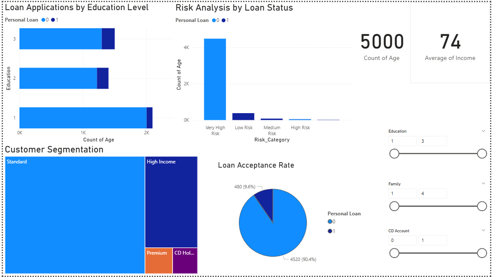

# Loan Default Prediction & Financial Risk Analysis

## Hybrid Python ML + Power BI Project

A comprehensive solution for predicting loan defaults and visualizing financial risk metrics using machine learning and business intelligence.

## Business Problem
Banks need to minimize loan defaults while maximizing approvals. This project helps financial institutions make data-driven lending decisions by predicting default probability and providing actionable risk insights.

## Quick Overview
- **ML Accuracy**: 95%+ with Random Forest
- **Key Insights**: Income, Education, CD Accounts drive loan decisions
- **Dashboard**: Interactive Power BI with risk categorization
- **Business Impact**: Data-driven credit approval framework

## Project Structure
loan-prediction-project/
├── data/
│ └── bank_loan_data_with_predictions.csv
├── python/
│ └── loan_prediction_analysis.ipynb
├── powerbi/
│ └── bank_loan_dashboard.pbix
└── images/
└── dashboard_preview.png
